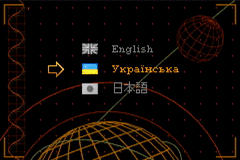
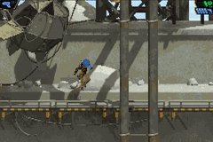
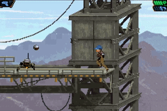

# Noonlight Paradox (GBA)

This small demo was made for [GBA Game Jam 2026](https://gbadev.net/). Some features:
- A fully playable open-source metroidvania platformer for GBA.
- Pre-rendered backgrounds and smooth character animations.
- Written in C++, but in a "functional" style. Does not rely on OOP/OOD.
- Written from scratch for the jam. Doesn't use third-party engines.
- Also uses CMake + code generation tools, written in Python.
- Three languages supported: English, Ukrainian, and Japanese.
- No AI-generated code/content.

## Showcase

 



## How To Build (Windows)

### Prerequisites

1. Install [DevKitPro](https://devkitpro.org/wiki/Getting_Started).
2. Run MSYS2.
3. If you want, try to build the [libtonc-examples](https://github.com/gbadev-org/libtonc-examples) (using `make`).
4. Get a GBA emulator (e.g. [NanoBoy](https://github.com/nba-emu/NanoBoyAdvance), [No$GBA](https://www.nogba.com/), [mGBA](https://mgba.io/), [VisualBoyAdvance](https://visualboyadvance.org/)), try to run the previously compiled examples.
5. Install Ninja for MSYS2: `pacman -S ninja`
6. *(optional)* Install Clang: `pacman -S clang`
7. *(optional)* For `clangd` support, install LLVM tools (with clangd).
8. Install Python, `PIL` and `numpy`: `pip install Pillow` and `pip install numpy`
9. In MSYS2, add environment variables `PYTHON` and `GIMPCONSOLE` with full path to the working python. E.g.:
```
export PYTHON="/c/Users/zegal/AppData/Local/Programs/Python/Python313/python.exe"
export GIMPCONSOLE="/c/Program Files/GIMP 3/bin/gimp-console.exe"
```
10. Install [GIMP](https://www.gimp.org/) (>=3.2). Make sure `gimp-console` is in the paths (both in your OS and in MSYS).

### Building ROM

1. Run `sh build.sh` inside MSYS2.
2. If successful, this will create `bin/game.gba` ROM file, ready to use.

### Clangd build for nvim

1. Run `build-clang.bat` from a normal terminal where clangd and clang are available. 
2. You can use `F2` to build the project from the nvim.

## Acknowledgments

### Manuals

1. https://gbadev.net/tonc/
2. https://problemkaputt.de/gbatek.htm
3. https://github.com/SanderMertens/ecs-faq

### Fonts

1. https://ggbot.itch.io/cairopixel-font (SIL Open Font License, Version 1.1.)
2. https://logotype.jp/nosutaru-dot.html (M+ FONT LICENSE)

### Other

1. https://en.wikipedia.org/wiki/Piano_key_frequencies
2. https://en.wikipedia.org/wiki/Color_difference
2. https://www.onemotion.com/chord-player/
2. https://alienryderflex.com/hsp.html
5. Python, `PIL` and `numpy`
4. https://www.blender.org/
3. https://www.pexels.com/
5. https://www.gimp.org/
6. https://krita.org/
8. https://neovim.io/
7. https://lmms.io/

## License

Made by Pavlo Savchuk (aka zegalur).
Game code is released under the MIT License. Game assets are CC-BY. (Both - where applicable.)
Third-party assets may have their own licenses attached as `LICENSE-[asset-type].txt`, `INFO-[asset-type].txt` or in other forms.
